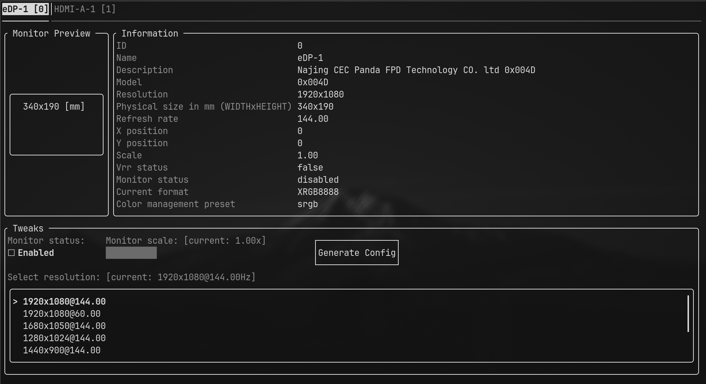
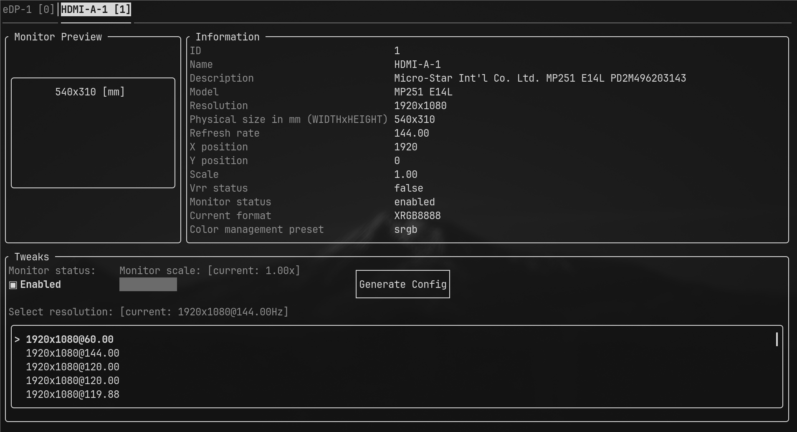
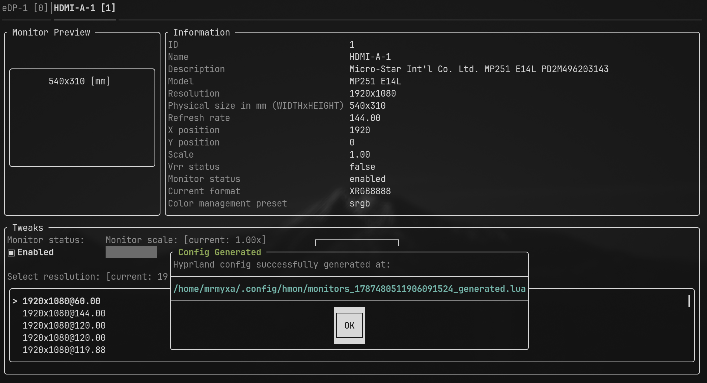
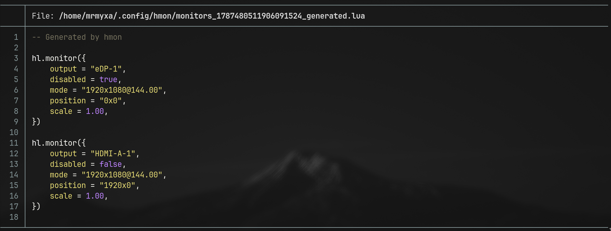

## Hmon (Hyprland Monitors)

## Overview 

### General

### Config autogen

### Features
- Automatic Lua config generation
- Real-time monitor updates & detection
- Resolution and refresh rate configuration
- Display scaling *(WIP / experimental)*
- Enable/disable monitors on the fly

### Build from source
- `git clone git@github.com:b1tflyyyy/hmon.git`
- `cd hmon && git submodule update --init --recursive`
- `mkdir build && cd build`
- `cmake -G Ninja -DCMAKE_C_COMPILER=clang -DCMAKE_CXX_COMPILER=clang++ -DCMAKE_LINKER_TYPE=MOLD -DLTO=ON -DCMAKE_BUILD_TYPE=Release ..`
- `ninja`

### Note: available options
- LTO (ON/OFF)
- ALUSAN (ON/OFF)
- MSAN (ON/OFF)
- TSAN (ON/OFF)

### Run
- `cd build/bin/Release && ./hmon`
